# 🏛️ Complete System Architecture: College Placement Portal, Ingestion Pipeline & CI/CD

---

## 📌 Executive Summary & Tuesday Kovion Showcase Objective

* **Target Milestone:** Deliver an end-to-end **Agile Review & Question Staging Portal** with automated **CI/CD, Agentic Validation, and Moodle XML Generation** by **Tuesday** for the executive presentation with **Kovion**.
* **Scale & Primary Stakeholders:** 5,000+ placement students, college faculty/mentors, and the junior developer batch.
* **Core Engineering Philosophy:** **"New Code Runs, Current Code Won't Break"** — strict zero-regression architecture, isolated staging database sandboxes, and automated Playwright test gates.
* **Hardware Infrastructure:**
  * **Portal Server:** Dedicated standalone Local College Server hosting the live portal and PostgreSQL database.
  * **AI Model Runner:** Local high-performance PC equipped with an **RTX 5070 GPU** running local open-source LLMs (Ollama / vLLM / Llama-3) with Groq Cloud fallback.

---

## 🧭 Master Architecture Flowchart (Snake / S-Curve Layout)

```mermaid
flowchart TD

    %% =========================================================================
    %% ROW 1: INGESTION -> CURATION -> SYNTHESIS (Goes Left to Right ->)
    %% =========================================================================
    subgraph ROW1 ["ROW 1: Ingestion & AI Synthesis (Left to Right ➡️)"]
        direction LR

        subgraph B1 ["1. Ingestion Sources"]
            In_Raw["<b>Student Prompt / Nightly Scrapers</b><br/>• Rough interview prompt text<br/>• LeetCode / Codeforces / CSES<br/>• Normalizes to Raw Input JSON"]
        end

        subgraph B2 ["2. Curation & Deduplication"]
            Curate_Engine["<b>Curation & Semantic Check</b><br/>• LLM cleans & writes constraints<br/>• 384-d vector embeddings<br/>• Cosine Similarity vs 5,000 DB<br/>• Drops duplicate if >= 0.85"]
        end

        subgraph B3 ["3. Solution & Testcase Generator"]
            Synth_Engine["<b>Synthesizer Engine</b><br/>• Generates optimal C++, Java, Python<br/>• 10 Standard I/O Test Cases<br/>(3 sample + 4 edge + 3 stress)"]
        end

        B1 -->|Raw Input| B2
        B2 -->|Unique Problem| B3
    end

    %% =========================================================================
    %% ROW 2: SANDBOX -> MOODLE XML & TAXONOMY (Goes Right to Left ⬅️)
    %% =========================================================================
    subgraph ROW2 ["ROW 2: Sandbox Validation & XML Packaging (Right to Left ⬅️)"]
        direction RL

        subgraph B4 ["4. Docker Execution Sandbox"]
            Sandbox_Engine["<b>Isolated Security Sandbox</b><br/>• Ephemeral container (128MB RAM, 2s limit)<br/>• Compiles & runs code against stdin<br/>• Verifies 10/10 testcases PASS"]
        end

        subgraph B5 ["5. Taxonomy & Moodle XML"]
            XML_Engine["<b>Moodle XML & Category Engine</b><br/>• Auto-tags: $course$/top/DSA/Graphs/BFS<br/>• Builds Moodle Quiz XML (CDATA escaped)"]
        end

        B4 -->|100% Passed ✅| B5
    end

    %% =========================================================================
    %% ROW 3: STAGING -> CI/CD -> PRODUCTION (Goes Left to Right ➡️)
    %% =========================================================================
    subgraph ROW3 ["ROW 3: Staging Review, CI/CD & Production (Left to Right ➡️)"]
        direction LR

        subgraph B6 ["6. Staging & Faculty Review"]
            Staging_UI["<b>Faculty Curation Dashboard</b><br/>• Isolated StagedQuestion DB table<br/>• Checkbox bulk selection<br/>• Re-route BFS / DFS / DP<br/>• 1-Click Approve to Live DB"]
        end

        subgraph B7 ["7. CI/CD & Agile Tracker"]
            CICD_Engine["<b>CI/CD & Progress Tracker</b><br/>• GitHub Actions CI + Playwright E2E<br/>• Jira-Style Milestone Checklist<br/>• Tuesday Kovion Showcase Tracker"]
        end

        subgraph B8 ["8. Production LMS & Portal"]
            Prod_Live["<b>Live Student Practice</b><br/>• Production DB on College Server<br/>• Moodle LMS Quiz XML Import<br/>• 5,000+ Placement Students"]
        end

        B6 -->|Mentor Approval| B7
        B7 -->|Zero-Downtime Deploy| B8
    end

    %% =========================================================================
    %% SNAKE / ZIGZAG CONNECTORS BETWEEN ROWS
    %% =========================================================================
    B3 ==>|Step 3 to 4: Turn Down ⬇️| B4
    B5 ==>|Step 5 to 6: Turn Down ⬇️| B6

    %% STYLING
    classDef row1Style fill:#0f172a,stroke:#38bdf8,stroke-width:2px,color:#fff;
    classDef row2Style fill:#1e1b4b,stroke:#818cf8,stroke-width:2px,color:#fff;
    classDef row3Style fill:#14532d,stroke:#4ade80,stroke-width:2px,color:#fff;

    class B1,B2,B3 row1Style;
    class B4,B5 row2Style;
    class B6,B7,B8 row3Style;
```



---

# 🔍 Detailed Stage-by-Stage Engineering Breakdown

```
[Row 1: Left to Right ➡️]
Stage 1 (Ingestion) ──▶ Stage 2 (Curation & Deduplication) ──▶ Stage 3 (Synthesis)
                                                                       │
                                                                       ▼ [Turn Down ⬇️]
[Row 2: Right to Left ⬅️]
Stage 5 (Taxonomy & XML) ◀── Stage 4 (Docker Sandbox Compilation) ◀────┘
       │
       ▼ [Turn Down ⬇️]
[Row 3: Left to Right ➡️]
Stage 6 (Staging & Review) ──▶ Stage 7 (CI/CD & Agile Tracker) ──▶ Stage 8 (Production & 5,000 Students)
```

---

### Stage 1: Ingestion & Raw Input Layer
* **Sources:**
  1. **Student / Faculty Rough Input:** Unstructured interview memories (*e.g. "Amazon asked: given an array, find minimum jumps..."*) or voice note transcripts.
  2. **Timed Scraper Cron Jobs:** Automated GitHub Actions / Local Cron runners querying LeetCode GraphQL, Codeforces problem archives, and CSES problem sets.
* **Normalized Ingestion Payload:**
  ```json
  {
    "raw_text": "Given an array of integers nums, return the length of the longest strictly increasing subsequence...",
    "source": "Student_Interview",
    "faculty_id": "mentor_siet",
    "timestamp": "2026-08-16T18:00:00Z"
  }
  ```

---

### Stage 2: Curation & Deduplication Engine
* **1. LLM Problem Structuring (RTX 5070 / Groq):** Cleans grammar and formats into 4 standard sections: **Title**, **Description**, **Input/Output format**, and **Mathematical Constraints** ($1 \le N \le 10^5$).
* **2. 384-Dimensional Embedding:** Vectorizes question text using `all-MiniLM-L6-v2` or `BGE-small`.
* **3. Cosine Similarity Deduplication:** Compares vector against the 5,000+ existing questions in the database.
  * **Formula:** $\text{Cosine Similarity} = \frac{\mathbf{A} \cdot \mathbf{B}}{\|\mathbf{A}\| \|\mathbf{B}\|}$
  * **Threshold $\ge 0.85$:** Duplicate detected $\rightarrow$ Links to existing Question ID in DB, halts pipeline.
  * **Threshold $< 0.85$:** Unique question verified $\rightarrow$ Proceeds to Stage 3.

---

### Stage 3: Solution & 10 Standard I/O Testcase Synthesizer
* **1. Optimal Multi-Language Reference Code:** Synthesizes verified optimal solutions in **C++20, Java 17, and Python 3.12**.
* **2. 10 Standard I/O Testcases:**
  * **3x Sample Cases:** Basic examples from the problem statement.
  * **4x Edge / Boundary Cases:** $N=1$, empty array, all negative numbers, duplicate numbers, boundary limits ($10^9$).
  * **3x Stress / Performance Cases:** Maximum size input ($N=10^5$) to test for Time Limit Exceeded ($O(N^2)$ vs $O(N \log N)$).
* **3. Formatting:** Single raw string separated by `\n` without brackets/commas, directly compatible with standard stream readers (`cin`, `Scanner`, `sys.stdin`).

---

### Stage 4: Docker Isolated Execution Sandbox
* **Container Security & Resource Limits:**
  * **RAM Limit:** Strict 128 MB maximum.
  * **Execution Timeout:** Strict 2.0 seconds maximum.
  * **Network:** Sockets and outbound traffic completely disabled.
* **Compilation & Execution Loop:**
  * `g++ -O3 solution.cpp -o solution.out && ./solution.out < input.in`
* **Verdict:** Compares actual `stdout` with expected `stdout`. Question only proceeds if **$10/10$ test cases pass**.

---

### Stage 5: Taxonomy Classifier & Moodle XML Transformer
* **1. Deep Category Mapping:** Maps problem into the college LMS category hierarchy:
  `$course$/top/Data Structures and Algorithms/Dynamic Programming/Longest Increasing Subsequence`
* **2. Moodle Quiz XML Schema:** Generates compliant XML with CDATA-escaped problem text, test case tables, and scoring rubrics.

---

### Stage 6: Isolated Staging Database & Faculty Review Dashboard
* **1. Staging Database (`StagedQuestion` Table):** Completely separated from live student tables.
* **2. Faculty Review Dashboard:**
  * **Bulk Checkboxes:** Select 10, 20, or 50 questions at once.
  * **Side-by-Side Diff Inspector:** Preview Description vs Solution vs 10 Test Cases.
  * **Category Switcher:** 1-Click re-routing to BFS, DFS, DP, Trees, SQL.
  * **1-Click Approve:** Safely promotes questions into the live database.

---

### Stage 7: CI/CD Quality Gates & Agile Project Progress Tracker
* **1. GitHub Actions CI:** Runs ESLint, TypeScript compilation (`tsc`), and XML validation unit tests on every git push.
* **2. Microsoft Playwright E2E Tests:** Headless browser robot automatically tests:
  * Faculty login & session persistence.
  * Checkbox bulk selection and category re-assignment.
  * Monaco editor code execution and testcase pass verdicts.
  * Moodle XML download file schema integrity.
* **3. Agile Project Tracker (Jira-Style):** Interactive milestone checklist for your mentor to track project completion % for the **Tuesday Kovion Showcase**.

---

### Stage 8: Live Production Server & College LMS
* **1. Production Database:** Hosted on the dedicated Local College Server.
* **2. College Moodle LMS:** Direct import of generated Moodle XML files.
* **3. 5,000+ Placement Students:** Practicing daily with zero downtime, zero broken test cases, and zero regression.

---

# 📋 Agile Sprint Checklist (Pre-Loaded for Dashboard)

### 📦 Epic 1: Multi-Source Scrapers & Raw Ingestion
- [x] **Task 1.1:** Build LeetCode problem scraper & normalizer *(Completed)*
- [x] **Task 1.2:** Build Codeforces & CSES question fetchers *(Completed)*
- [ ] **Task 1.3:** Build Student Rough Interview Prompt intake modal *(Assigned to Junior 1 - Sunday)*
- [ ] **Task 1.4:** Build 5,000+ question deduplication similarity matcher *(Assigned to Junior 2 - Sunday)*

### 🧠 Epic 2: AI Lab Local Inference & Agentic Validator
- [x] **Task 2.1:** Groq Cloud Llama-3.3 testcase generation prompt engine *(Completed)*
- [ ] **Task 2.2:** Set up local Ollama / vLLM endpoint on RTX 5070 PC *(Assigned to Junior 3 - Sunday)*
- [ ] **Task 2.3:** Standard I/O 10-testcase verification sandbox agent *(Assigned to Lead Developer - Monday)*
- [ ] **Task 2.4:** Automated Taxonomy Classification Agent (BFS, DFS, DP, SQL) *(Assigned to Lead Developer - Monday)*

### 🖥️ Epic 3: Staging, Curation & Moodle XML Export UI
- [x] **Task 3.1:** Basic Moodle XML Essay format generator *(Completed)*
- [ ] **Task 3.2:** Build Checkbox-based Faculty Staging Queue with bulk category selector *(Assigned to Junior 4 - Sunday)*
- [ ] **Task 3.3:** Build Side-by-Side Question & Testcase Inspector Modal *(Assigned to Junior 4 - Sunday)*
- [ ] **Task 3.4:** Hierarchical Moodle XML Category Builder (`$course$/top/...`) *(Assigned to Lead Developer - Monday)*

### ⚙️ Epic 4: CI/CD Pipeline, Playwright E2E & Agile Progress Tracker
- [ ] **Task 4.1:** Build Interactive Agile Project Progress Dashboard with Live Checkboxes *(Monday Morning)*
- [ ] **Task 4.2:** Configure GitHub Actions CI for Linting, Typecheck & Unit Tests *(Monday Afternoon)*
- [ ] **Task 4.3:** Configure Scheduled Cron Scraper Workflow (`.github/workflows/scraper.yml`) *(Monday Afternoon)*
- [ ] **Task 4.4:** Write Playwright E2E automated test suite *(Assigned to Junior 5 - Monday)*
- [ ] **Task 4.5:** Final Polish & Dry Run for Tuesday **Kovion** Company Showcase *(Tuesday Morning)*
